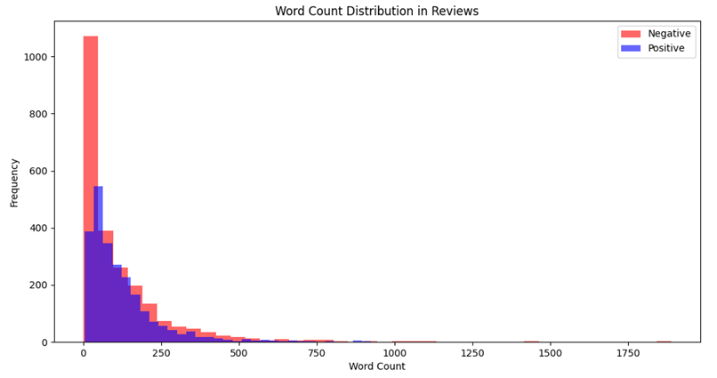
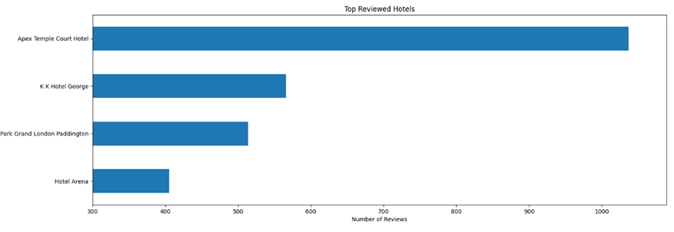
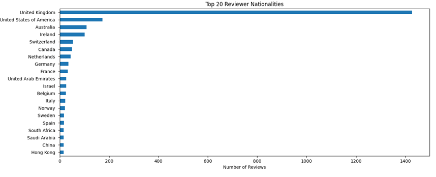
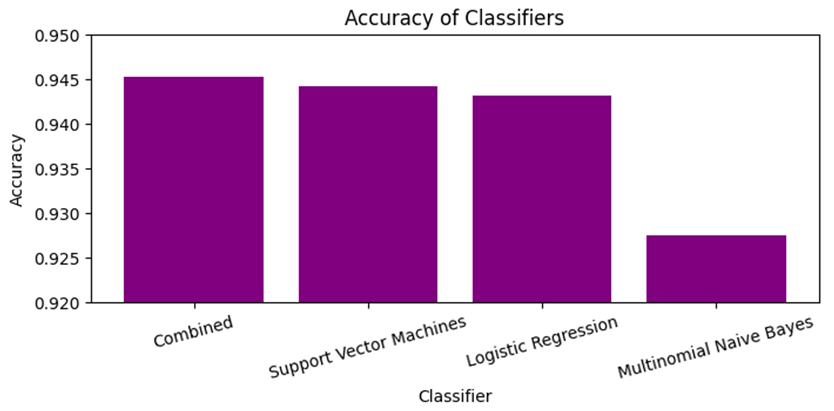
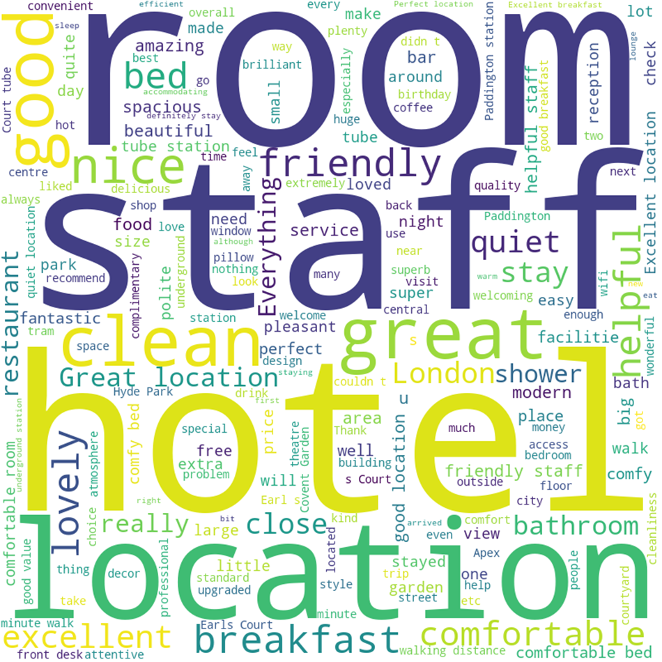

# Big Data - Assignment 1
## Inleiding
In dit rapport zal ik uitleggen wat ik in mijn project heb gedaan en waarom. Ook zal ik de resultaten laten zien doormiddel van plots.
## Datasets
Op het moment gebruik ik 2 datasets de CSV die is meegegeven en 10 handmatige reviews er is een plan om een 3e dataset toe te voegen die reviews van booking.com haalt het heeft 26386 records. https://data.world/opensnippets/bookingcom-reviews-dataset
## Proces
### Database
Voor de database heb ik een sql database aangemaakt via python dat vereist wel dat je sql op je systeem hebt. In de database heb ik alle info gezet uit meerdere bronnen die nodig is om later de modellen te bouwen met behulp van een stored procedure die ook aangemaakt en geroepen word door behulp van python.
### Modellen 
Ik ben begonnen met 6 modellen na het testen van de accuraatheid en snelheid op een deel van de dataset heb ik besloten om 3 ervan te verwijderen random forest, gradient boosting en k-nearest neighbors omdat ze niet accuraat of te langzaam waren, ik heb logistic regression, multinomial naive bayes en support vector gehouden omdat ze allemaal snel waren en accurater zijn dan 0,92 op mijn model. Door de modellen te combineren gaat de accuraatheid naar 0,94. 
### Plots
Ik heb 2 wordclouds gemaakt 1 voor de positieve en 1 voor de negatieve. Daarna heb ik 3 plots over info over de reviews of reviewers gemaakt zoals welk hotel de reviews voor gemaakt zijn, waar de mensen vandaan komen en hoeveel woorden er in de reviews zitten en hoe dat verdeeld is over de positieve en negatieve reviews. Als laatste heb ik de accuraatheid van de classifiers in een grafiek gezet

### Conclusie
Dit model is redelijk accuraat maar kan nog beter worden door te finetunen dat kan gedaan worden door strenger te kijken naar of iets positief of negatief beoordeeld word ook kan je kijken naar de false negative en positive om er achter te komen waarom die fout zijn.

Een andere optie is om de dataset uit te bereiden om een diversere modellen te krijgen die zullen beter werken op nieuwe reviews bij andere hotels, locaties en nationaliteiten.
